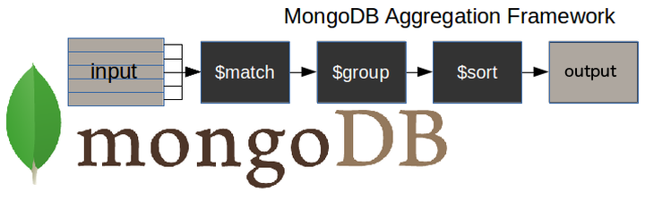
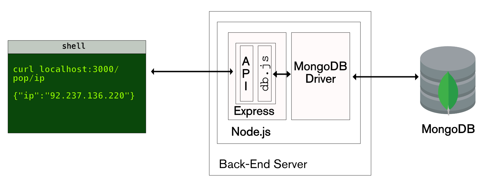
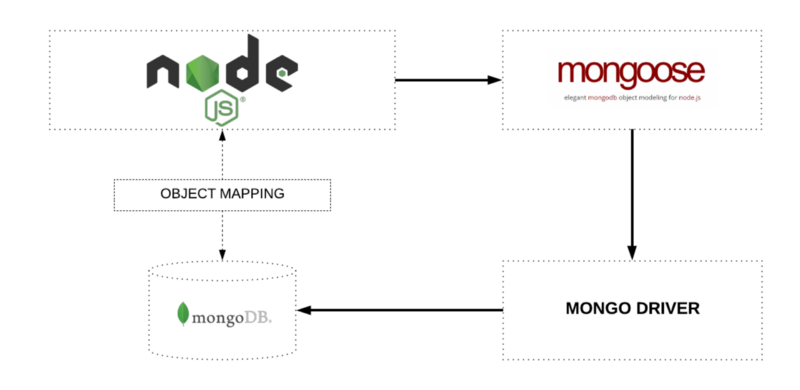
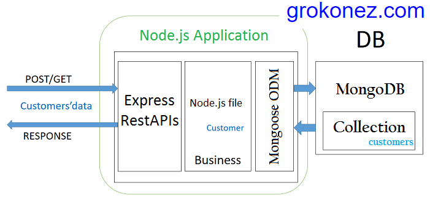
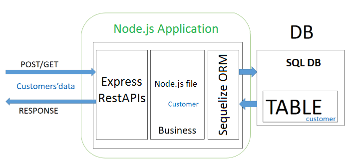
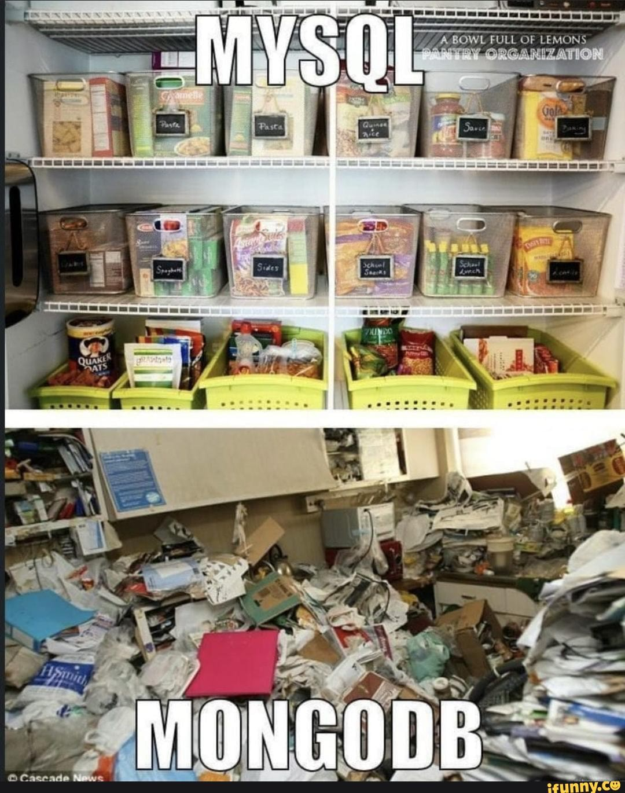

# [Bootcamp Web Developer Full Stack](https://www.thebridge.tech/bootcamps/bootcamp-fullstack-developer/)
### JS, ES6, Node.js, Frontend, Backend, Express, React, MERN, testing, DevOps

### Introducción a BBDD NoSQL con MongoDB


- [MongoDB](https://www.mongodb.com/es)
- [MongoDB | NoSQL Explained](https://www.mongodb.com/es/nosql-explained)

### MongoDB vs SQL ¿Cuándo usar cada una?

### SQL vs NoSQL: Diferencias clave

#### SQL (Bases de datos relacionales)
- **Estructura**: Basadas en tablas con filas y columnas. Los datos se organizan en relaciones (tablas).
- **Esquema**: Esquema fijo y predefinido. Los datos deben ajustarse a una estructura rígida.
- **Consultas**: Utilizan SQL (Structured Query Language) para realizar consultas y operaciones.
- **Escalabilidad**: Escalabilidad vertical (aumentar recursos en un solo servidor).
- **Integridad**: Garantizan integridad referencial y transacciones ACID (Atomicidad, Consistencia, Aislamiento, Durabilidad).
- Aplicaciones con datos estructurados, como sistemas financieros, ERP, CRM, etc.

#### NoSQL (Bases de datos no relacionales)
- **Estructura**: Basadas en documentos, clave-valor, grafos o columnas. Los datos no tienen una estructura fija.
- **Esquema**: Esquema flexible o sin esquema. Permite almacenar datos no estructurados o semiestructurados.
- **Consultas**: Lenguajes específicos según el tipo de base de datos (por ejemplo, consultas JSON en MongoDB).
- **Escalabilidad**: Escalabilidad horizontal (añadir más servidores para manejar la carga).
- **Flexibilidad**: Diseñadas para manejar grandes volúmenes de datos y alta velocidad de escritura/lectura.
- Big Data, aplicaciones en tiempo real, redes sociales, IoT, etc.

#### Comparación
| Característica       | SQL                          | NoSQL                        |
|----------------------|------------------------------|------------------------------|
| **Modelo de datos**  | Relacional                  | No relacional                |
| **Esquema**          | Fijo                        | Flexible                     |
| **Escalabilidad**    | Vertical                    | Horizontal                   |
| **Transacciones**    | ACID                        | Eventualmente consistentes   |
| **Velocidad**        | Más lento en grandes datos  | Optimizado para grandes datos|
| **Casos de uso**     | Datos estructurados         | Datos no estructurados       |

#### Recursos adicionales
- [SQL vs NoSQL | DigitalOcean](https://www.digitalocean.com/community/tutorials/sql-vs-nosql-databases)
- [SQL vs NoSQL | AWS](https://aws.amazon.com/nosql/)
- [MongoDB | mongodb-mysql](https://www.mongodb.com/es/resources/compare/mongodb-mysql)
- [AWS | the-difference-between-mongodb-vs-mysql](https://aws.amazon.com/es/compare/the-difference-between-mongodb-vs-mysql/)
- [Video IBM | MySQL vs MongoDB](https://youtu.be/OdgZ0jr4jpM?si=u_HTNTN0JeeuVJLN)
- [7-razones-mongodb](https://platzi.com/blog/7-razones-mongodb/)
- [que-es-mongodb](https://openwebinars.net/blog/que-es-mongodb/)
- [mysql-vs-mongodb-cuando-y-donde-usar-cada-uno](https://impactotecno.wordpress.com/2018/02/26/mysql-vs-mongodb-cuando-y-donde-usar-cada-uno)
- [mongodb-como-funciona](https://siliconnews.plataformasinc.es/mongodb-como-funciona/)

### MongoDB - Ejemplos de apps - casos de uso

MongoDB es una base de datos NoSQL ampliamente utilizada en aplicaciones modernas debido a su flexibilidad, escalabilidad y capacidad para manejar grandes volúmenes de datos no estructurados. A continuación, se presentan algunos ejemplos de aplicaciones y casos de uso donde MongoDB es una excelente opción:

#### Aplicaciones de redes sociales
- Almacenar perfiles de usuarios, publicaciones, comentarios, reacciones y mensajes.
- Su esquema flexible permite manejar datos no estructurados y cambiar la estructura de los documentos sin afectar la base de datos.

#### Comercio electrónico
- Gestión de catálogos de productos, carritos de compra, historial de pedidos y reseñas de clientes.
- **Razón para usar MongoDB**: La capacidad de manejar datos jerárquicos como productos con múltiples variantes y atributos.

#### Aplicaciones de IoT (Internet de las cosas)
- Almacenar datos de sensores, registros de eventos y análisis en tiempo real.
- **Razón para usar MongoDB**: Su capacidad para manejar grandes volúmenes de datos y realizar consultas rápidas.

#### Sistemas de análisis de datos
- Procesar y analizar grandes volúmenes de datos para obtener información útil.
- **Razón para usar MongoDB**: Su soporte para operaciones de agregación y consultas complejas.

#### Aplicaciones de contenido multimedia
- Almacenar metadatos de imágenes, videos y archivos de audio.
- **Razón para usar MongoDB**: Su capacidad para manejar datos no estructurados y consultas rápidas.

#### Gestión de contenido (CMS)
- Almacenar y gestionar contenido dinámico como blogs, páginas web y artículos.
- **Razón para usar MongoDB**: Su flexibilidad para manejar diferentes tipos de contenido y estructuras.

#### Aplicaciones de geolocalización
- Almacenar datos de ubicación, realizar búsquedas cercanas y análisis geoespacial.
- **Razón para usar MongoDB**: Su soporte para índices geoespaciales y consultas relacionadas.

#### Aplicaciones financieras
- Gestión de transacciones, análisis de riesgos y detección de fraudes.
- **Razón para usar MongoDB**: Su capacidad para manejar datos en tiempo real y realizar análisis complejos.

#### Big Data y análisis en tiempo real
- Procesar grandes volúmenes de datos generados por usuarios o sistemas.
- **Razón para usar MongoDB**: Su escalabilidad horizontal y soporte para particionamiento.

#### Aplicaciones de mensajería y chat
- Almacenar mensajes, historial de conversaciones y datos de usuarios.
- **Razón para usar MongoDB**: Su capacidad para manejar datos no estructurados y consultas rápidas.

#### Recursos adicionales
- [MongoDB | Casos de uso](https://www.mongodb.com/solutions/use-cases)
- [Real-world use cases of MongoDB](https://www.knowledgehut.com/blog/web-development/real-world-use-cases-of-mongodb)
- [MongoDB use case examples](https://hevodata.com/learn/mongodb-use-case/)
- [mongodb-real-world-use-cases](https://www.upgrad.com/blog/mongodb-real-world-use-cases/)

### MongoDB atlas - deploy de tu BBDD en cloud


### ¿Qué es MongoDB Atlas?

MongoDB Atlas es una plataforma de base de datos como servicio (DBaaS) completamente administrada que permite implementar, operar y escalar bases de datos MongoDB en la nube. Proporciona una solución sencilla y eficiente para gestionar bases de datos sin preocuparse por la infraestructura subyacente.

#### Características principales:
- **Despliegue en múltiples nubes**: Compatible con AWS, Google Cloud y Microsoft Azure.
- **Escalabilidad automática**: Ajusta automáticamente los recursos según las necesidades de la aplicación.
- **Alta disponibilidad**: Réplicas distribuidas geográficamente para garantizar la continuidad del servicio.
- **Seguridad avanzada**: Cifrado de datos en reposo y en tránsito, autenticación robusta y controles de acceso.
- **Supervisión y análisis**: Herramientas integradas para monitorear el rendimiento y optimizar consultas.
- **Backups automáticos**: Copias de seguridad programadas para proteger los datos.

#### Ventajas:
- Reducción de la complejidad operativa.
- Implementación rápida de bases de datos en la nube.
- Integración con herramientas de desarrollo y análisis.
- Escalabilidad sin interrupciones.

#### Recursos adicionales:
- [MongoDB Atlas | Página oficial](https://www.mongodb.com/atlas)
- [Introducción a MongoDB Atlas](https://www.mongodb.com/docs/atlas/getting-started/)
- [MongoDB | Atlas](https://www.mongodb.com/es/atlas)
- [MongoDB | Atlas](https://www.mongodb.com/lp/cloud/atlas/try4)
- [MongoDB | Qué es MongoDB Atlas + Get started](https://www.mongodb.com/docs/atlas/)

### NoSQL con MongoDB - Estructura


- Colecciones


- Documentos


### Modelado de datos en MongoDB

#### Modelo de datos embebido

El modelo de datos embebido en MongoDB consiste en almacenar datos relacionados dentro de un mismo documento en lugar de dividirlos en múltiples colecciones. Este enfoque es útil cuando los datos relacionados se consultan juntos con frecuencia, ya que reduce la necesidad de realizar uniones o múltiples consultas.

##### Ventajas:
- **Rendimiento mejorado**: Las consultas son más rápidas porque los datos relacionados están en el mismo documento.
- **Simplicidad**: Menos necesidad de realizar uniones o referencias entre colecciones.
- **Atomicidad**: Las operaciones de escritura en un solo documento son atómicas.

##### Desventajas:
- **Tamaño del documento**: Los documentos tienen un límite de 16 MB, lo que puede ser un problema si los datos embebidos son muy grandes.
- **Redundancia**: Puede haber duplicación de datos si los mismos datos embebidos se repiten en múltiples documentos.

##### Ejemplo:
Supongamos que tenemos una base de datos para gestionar pedidos de una tienda en línea. Un modelo embebido podría verse así:

```json
{
    "_id": 1,
    "cliente": {
        "nombre": "Juan Pérez",
        "email": "juan.perez@example.com"
    },
    "productos": [
        {
            "nombre": "Laptop",
            "cantidad": 1,
            "precio": 1200
        },
        {
            "nombre": "Mouse",
            "cantidad": 2,
            "precio": 25
        }
    ],
    "fecha": "2023-10-01",
    "total": 1250
}
```

En este ejemplo, los datos del cliente y los productos están embebidos dentro del documento del pedido.

##### Casos de uso:
- Datos que tienen una relación uno a pocos o pocos a pocos.
- Datos que se consultan juntos con frecuencia.
- Escenarios donde los datos relacionados no cambian con frecuencia.

##### Más información:
- [MongoDB | Model Embedded Relationships](https://www.mongodb.com/docs/manual/tutorial/model-embedded-one-to-one-relationships-between-documents/)
- [MongoDB | Data Modeling](https://www.mongodb.com/docs/manual/core/data-model-design/)
- [MongoDB | Embedded Data Models](https://www.mongodb.com/docs/manual/core/data-models-embedded/)


- [MongoDB | model-embedded-one-to-one-relationships-between-documents](https://docs.mongodb.com/manual/tutorial/model-embedded-one-to-one-relationships-between-documents/)


#### Modelo de datos normalizado

El modelo de datos normalizado en MongoDB implica dividir los datos relacionados en múltiples colecciones y establecer referencias entre ellas. Este enfoque es útil cuando los datos relacionados cambian con frecuencia o cuando se necesita evitar la duplicación de datos.

##### Ventajas:
- **Reducción de redundancia**: Minimiza la duplicación de datos, lo que ahorra espacio de almacenamiento.
- **Mantenimiento más sencillo**: Los cambios en los datos relacionados solo necesitan realizarse en un lugar.
- **Escalabilidad**: Facilita la gestión de datos complejos y relaciones entre ellos.

##### Desventajas:
- **Consultas más complejas**: Requiere realizar múltiples consultas o uniones para obtener datos relacionados.
- **Rendimiento**: Las consultas pueden ser más lentas debido a la necesidad de combinar datos de varias colecciones.

### ¿Cuándo considerar SQL para muchas relaciones?

Cuando una aplicación tiene muchas relaciones complejas entre datos, como relaciones uno a muchos o muchos a muchos, SQL puede ser una mejor opción debido a las siguientes razones:

#### Ventajas de SQL para relaciones complejas:
1. **Integridad referencial**: Las bases de datos relacionales garantizan la consistencia de las relaciones mediante claves primarias y foráneas.
2. **Consultas avanzadas**: SQL permite realizar uniones (`JOIN`) para combinar datos de múltiples tablas de manera eficiente.
3. **Estructura fija**: Un esquema predefinido asegura que los datos sigan una estructura clara y organizada.
4. **Transacciones ACID**: Las bases de datos SQL garantizan transacciones seguras y consistentes, lo que es crucial para aplicaciones críticas.
5. **Herramientas maduras**: SQL tiene un ecosistema robusto de herramientas para modelado, análisis y optimización de consultas.

#### Recursos adicionales:
- [SQL vs NoSQL | Cuándo usar cada uno](https://www.mongodb.com/nosql-explained)
- [Relational Databases | IBM](https://www.ibm.com/topics/relational-databases)
- [SQL vs NoSQL | AWS](https://aws.amazon.com/nosql/)

##### Ejemplo:
Supongamos que tenemos una base de datos para gestionar pedidos de una tienda en línea. Un modelo normalizado podría verse así:

**Colección de clientes:**
```json
{
    "_id": 1,
    "nombre": "Juan Pérez",
    "email": "juan.perez@example.com"
}
```

**Colección de pedidos:**
```json
{
    "_id": 101,
    "cliente_id": 1,
    "fecha": "2023-10-01",
    "total": 1250
}
```

**Colección de productos:**
```json
{
    "_id": 201,
    "pedido_id": 101,
    "nombre": "Laptop",
    "cantidad": 1,
    "precio": 1200
},
{
    "_id": 202,
    "pedido_id": 101,
    "nombre": "Mouse",
    "cantidad": 2,
    "precio": 25
}
```

En este ejemplo, los datos del cliente, los pedidos y los productos están separados en diferentes colecciones, y las relaciones se establecen mediante identificadores.

##### Casos de uso:
- Datos que tienen relaciones uno a muchos o muchos a muchos.
- Escenarios donde los datos relacionados cambian con frecuencia.
- Aplicaciones que requieren evitar la duplicación de datos.


- [MongoDB | database-references](https://docs.mongodb.com/manual/reference/database-references/)

##### Más información:
- [MongoDB | Data Modeling](https://www.mongodb.com/docs/manual/core/data-model-design/)
- [MongoDB | Model Referenced Relationships](https://www.mongodb.com/docs/manual/tutorial/model-referenced-one-to-many-relationships-between-documents/)
- [MongoDB - Relationships | Tutorialspoint](https://www.tutorialspoint.com/mongodb/mongodb_relationships.htm)

### CRUD en MongoDB - Operaciones básicas
>En informática, CRUD es el acrónimo de "Crear, Leer, Actualizar y Borrar", que se usa para referirse a las funciones básicas en bases de datos o la capa de persistencia en un software. [Wikipedia](https://es.wikipedia.org/wiki/CRUD)


- [crud-las-principales-operaciones-de-bases-de-datos](https://www.ionos.es/digitalguide/paginas-web/desarrollo-web/crud-las-principales-operaciones-de-bases-de-datos/)
- [operaciones-crud-en-mongodb](https://platzi.com/contributions/operaciones-crud-en-mongodb/)
- [cosas-basicas-de-un-crud-en-mongodb](https://platzi.com/tutoriales/1533-mongodb/4102-cosas-basicas-de-un-crud-en-mongodb/)
- [MongoDB | Cheatsheet](https://www.mongodb.com/developer/products/mongodb/cheat-sheet/)

### CRUD Básico en MongoDB desde la Terminal

A continuación, se muestra cómo realizar las operaciones CRUD (Crear, Leer, Actualizar y Eliminar) básicas en MongoDB utilizando comandos directamente en la terminal de MongoDB.

#### Comandos básicos para manejar MongoDB en la terminal
1. **Conectarse a MongoDB**:
   ```bash
   mongo
   ```

2. **Listar bases de datos**:
   ```bash
   show dbs
   ```

3. **Seleccionar o crear una base de datos**:
   ```bash
   use nombre_base_datos
   ```

4. **Listar colecciones**:
   ```bash
   show collections
   ```

5. **Eliminar una colección**:
   ```bash
   db.nombre_coleccion.drop()
   ```

6. **Eliminar una base de datos**:
   ```bash
   db.dropDatabase()
   ```

#### Crear (Create)
Para insertar documentos en una colección, usamos el comando `insertOne` o `insertMany`.

```bash
# Insertar un solo documento
db.usuarios.insertOne({
    nombre: "Juan",
    edad: 30,
    email: "juan@example.com"
});

# Insertar múltiples documentos
db.usuarios.insertMany([
    { nombre: "Ana", edad: 25, email: "ana@example.com" },
    { nombre: "Luis", edad: 35, email: "luis@example.com" },
    { nombre: "Carlos", edad: 28, email: "carlos@example.com" },
    { nombre: "María", edad: 32, email: "maria@example.com" },
    { nombre: "Jorge", edad: 40, email: "jorge@example.com" },
    { nombre: "Lucía", edad: 22, email: "lucia@example.com" },
    { nombre: "Pedro", edad: 29, email: "pedro@example.com" },
    { nombre: "Sofía", edad: 27, email: "sofia@example.com" },
    { nombre: "Elena", edad: 31, email: "elena@example.com" },
    { nombre: "Miguel", edad: 36, email: "miguel@example.com" }
]);
```

#### Leer (Read)
Para consultar documentos, usamos el comando `find`.

```bash
# Obtener todos los documentos
db.usuarios.find();

# Obtener documentos con una condición
db.usuarios.find({ edad: { $gt: 30 } });

# Obtener documentos con proyección (mostrar solo campos específicos)
db.usuarios.find({ edad: { $gt: 30 } }, { nombre: 1, email: 1, _id: 0 });

# Obtener documentos cuyo nombre comience con "A" usando regex
db.usuarios.find({ nombre: { $regex: /^A/, $options: "i" } });
```

#### Actualizar (Update)
Para modificar documentos, usamos los comandos `updateOne`, `updateMany` o `replaceOne`.

```bash
# Actualizar un solo documento
db.usuarios.updateOne(
    { nombre: "Juan" },
    { $set: { edad: 31 } } 
);

# Actualizar múltiples documentos
db.usuarios.updateMany(
    { edad: { $lt: 30 } },
    { $set: { activo: true } }
);

# Reemplazar un documento completo
db.usuarios.replaceOne(
    { nombre: "Luis" },
    { nombre: "Luis", edad: 36, email: "luis_nuevo@example.com" } 
);
```

#### Eliminar (Delete)
Para eliminar documentos, usamos los comandos `deleteOne` o `deleteMany`.

```bash
# Eliminar un solo documento
db.usuarios.deleteOne({ nombre: "Ana" });

# Eliminar múltiples documentos
db.usuarios.deleteMany({ edad: { $gt: 30 } });
```

#### Ejemplo Completo
```bash
# Crear
db.productos.insertMany([
    { nombre: "Laptop", precio: 1200, stock: 10 },
    { nombre: "Mouse", precio: 25, stock: 50 },
    { nombre: "Teclado", precio: 45, stock: 30 }
]);

# Leer
db.productos.find({ precio: { $lt: 50 } });

# Leer con regex
db.productos.find({ nombre: { $regex: /Mouse/, $options: "i" } });

# Actualizar
db.productos.updateOne(
    { nombre: "Mouse" },
    { $set: { stock: 45 } }
);

# Eliminar
db.productos.deleteOne({ nombre: "Teclado" });
```

### Ejemplo de acceso a documentos con arrays u objetos internos

A continuación, se muestra un ejemplo de cómo acceder a documentos que contienen arrays u objetos internos en MongoDB utilizando la terminal:

#### Ejemplo de documento
Supongamos que tenemos una colección llamada `pedidos` con los siguientes documentos:

```json
{
    "_id": 1,
    "cliente": {
        "nombre": "Juan Pérez",
        "email": "juan.perez@example.com"
    },
    "productos": [
        { "nombre": "Laptop", "cantidad": 1, "precio": 1200 },
        { "nombre": "Mouse", "cantidad": 2, "precio": 25 }
    ],
    "fecha": "2023-10-01",
    "total": 1250
},
{
    "_id": 2,
    "cliente": {
        "nombre": "Ana López",
        "email": "ana.lopez@example.com"
    },
    "productos": [
        { "nombre": "Teclado", "cantidad": 1, "precio": 45 },
        { "nombre": "Monitor", "cantidad": 1, "precio": 200 }
    ],
    "fecha": "2023-10-02",
    "total": 245
}
```

#### Consultas de ejemplo

0. **Carga los datos**:
   ```bash
   db.pedidos.insertMany(
                            [
                                {
                                    "cliente": {
                                        "nombre": "Juan Pérez",
                                        "email": "juan.perez@example.com"
                                    },
                                    "productos": [
                                        { "nombre": "Laptop", "cantidad": 1, "precio": 1200 },
                                        { "nombre": "Mouse", "cantidad": 2, "precio": 25 }
                                    ],
                                    "fecha": "2023-10-01",
                                    "total": 1250
                                },
                                {
                                    "cliente": {
                                        "nombre": "Ana López",
                                        "email": "ana.lopez@example.com"
                                    },
                                    "productos": [
                                        { "nombre": "Teclado", "cantidad": 1, "precio": 45 },
                                        { "nombre": "Monitor", "cantidad": 1, "precio": 200 }
                                    ],
                                    "fecha": "2023-10-02",
                                    "total": 245
                                }
                            ]
                    );
   ```
1. **Acceder a un campo dentro de un objeto interno**:
   Obtener el nombre del cliente de todos los pedidos:
   ```bash
   db.pedidos.find({}, { "cliente.nombre": 1, _id: 0 });
   ```

2. **Filtrar documentos por un valor dentro de un array**:
   Obtener los pedidos que incluyan un producto llamado "Laptop":
   ```bash
   db.pedidos.find({ "productos.nombre": "Laptop" });
   ```

3. **Acceder a un campo específico dentro de un array**:
   Obtener solo los nombres de los productos de cada pedido:
   ```bash
   db.pedidos.find({}, { "productos.nombre": 1, _id: 0 });
   ```

4. **Filtrar por una condición en un campo dentro de un array**:
   Obtener los pedidos donde algún producto tenga un precio mayor a 100:
   ```bash
   db.pedidos.find({ "productos.precio": { $gt: 100 } });
   ```

5. **Proyección de un campo específico dentro de un objeto interno**:
   Obtener el email de los clientes junto con el total del pedido:
   ```bash
   db.pedidos.find({}, { "cliente.email": 1, total: 1, _id: 0 });
   ```

#### Recursos adicionales
- [MongoDB | Query Arrays](https://www.mongodb.com/docs/manual/tutorial/query-arrays/)
- [MongoDB | Query Embedded Documents](https://www.mongodb.com/docs/manual/tutorial/query-embedded-documents/)


#### Recursos adicionales
- [MongoDB CRUD Operations](https://www.mongodb.com/docs/manual/crud/)
- [MongoDB Query Operators](https://www.mongodb.com/docs/manual/reference/operator/query/)
- [MongoDB Update Operators](https://www.mongodb.com/docs/manual/reference/operator/update/)


### MongoDB - Agregación

Las operaciones basadas en agregaciones nos permiten procesar datos registrados para obtener resultados que aportan información útil. En otras palabras, nos permiten transformar datos en información valiosa. 
La agregación en MongoDB sigue una estructura tipo "pipeline", donde los datos pasan por diferentes etapas, y cada etapa toma la salida de la anterior para realizar operaciones específicas.

#### Principales etapas del pipeline de agregación:
1. **$match**: Filtra documentos según criterios específicos (similar a `find`).
2. **$group**: Agrupa documentos por un campo y realiza cálculos agregados (como sumas, promedios, etc.).
3. **$project**: Selecciona y transforma campos en los documentos de salida.
4. **$sort**: Ordena los documentos por uno o más campos.
5. **$limit**: Limita el número de documentos en la salida.
6. **$skip**: Omite un número específico de documentos.
7. **$unwind**: Descompone arrays en documentos individuales.
8. **$lookup**: Realiza un "join" entre colecciones.
9. **$addFields**: Agrega nuevos campos a los documentos.

#### Ejemplos de agregación en MongoDB

##### 1. Filtrar documentos con `$match`
Filtrar empleados con salario mayor a 6000:
```bash
db.employees.aggregate([
    { $match: { salary: { $gt: 6000 } } }
]);
```

##### 2. Agrupar documentos con `$group`
Agrupar empleados por departamento y calcular el total de salarios:
```bash
db.employees.aggregate([
    { $group: { _id: "$department.name", totalSalaries: { $sum: "$salary" } } }
]);
```

##### 3. Seleccionar campos con `$project`
Mostrar solo el nombre completo y el salario de los empleados:
```bash
db.employees.aggregate([
    { $project: { fullName: { $concat: ["$firstName", " ", "$lastName"] }, salary: 1, _id: 0 } }
]);
```

##### 4. Ordenar documentos con `$sort`
Ordenar empleados por salario en orden descendente:
```bash
db.employees.aggregate([
    { $sort: { salary: -1 } }
]);
```

##### 5. Limitar resultados con `$limit`
Obtener los 3 empleados con los salarios más altos:
```bash
db.employees.aggregate([
    { $sort: { salary: -1 } },
    { $limit: 3 }
]);
```

##### 6. Descomponer arrays con `$unwind`
Supongamos que cada empleado tiene un array de habilidades (`skills`). Para descomponer este array:
```bash
db.employees.aggregate([
    { $unwind: "$skills" }
]);
```

##### 7. Realizar un "join" con `$lookup`
Unir empleados con otra colección llamada `departments`:
```bash
db.employees.aggregate([
    { $lookup: {
        from: "departments",
        localField: "department.name",
        foreignField: "name",
        as: "departmentDetails"
    } }
]);
```

##### 8. Agregar nuevos campos con `$addFields`
Agregar un campo `bonus` que sea el 10% del salario:
```bash
db.employees.aggregate([
    { $addFields: { bonus: { $multiply: ["$salary", 0.1] } } }
]);
```
### Ejemplo de MongoDB con Pipeline de Aggregation

#### Añadir documentos a la colección `ventas`
```bash
db.ventas.insertMany([
    { _id: 1, producto: "Laptop", categoria: "Electrónica", precio: 1200, cantidad: 5, fecha: new Date("2023-10-01") },
    { _id: 2, producto: "Mouse", categoria: "Electrónica", precio: 25, cantidad: 50, fecha: new Date("2023-10-02") },
    { _id: 3, producto: "Teclado", categoria: "Electrónica", precio: 45, cantidad: 30, fecha: new Date("2023-10-03") },
    { _id: 4, producto: "Silla", categoria: "Muebles", precio: 150, cantidad: 10, fecha: new Date("2023-10-04") },
    { _id: 5, producto: "Mesa", categoria: "Muebles", precio: 300, cantidad: 5, fecha: new Date("2023-10-05") },
    { _id: 6, producto: "Monitor", categoria: "Electrónica", precio: 200, cantidad: 20, fecha: new Date("2023-10-06") },
    { _id: 7, producto: "Lámpara", categoria: "Muebles", precio: 50, cantidad: 15, fecha: new Date("2023-10-07") },
    { _id: 8, producto: "Auriculares", categoria: "Electrónica", precio: 80, cantidad: 25, fecha: new Date("2023-10-08") },
    { _id: 9, producto: "Impresora", categoria: "Electrónica", precio: 300, cantidad: 8, fecha: new Date("2023-10-09") },
    { _id: 10, producto: "Estantería", categoria: "Muebles", precio: 100, cantidad: 12, fecha: new Date("2023-10-10") }
]);
```

#### Pipeline de Aggregation

1. **Filtrar productos de la categoría "Electrónica" con `$match`**:
   ```bash
   db.ventas.aggregate([
       { $match: { categoria: "Electrónica" } }
   ]);
   ```

2. **Agrupar por categoría y calcular el total de ingresos con `$group`**:
   ```bash
   db.ventas.aggregate([
       { $group: { _id: "$categoria", totalIngresos: { $sum: { $multiply: ["$precio", "$cantidad"] } } } }
   ]);
   ```

3. **Ordenar los productos por precio descendente con `$sort`**:
   ```bash
   db.ventas.aggregate([
       { $sort: { precio: -1 } }
   ]);
   ```

4. **Proyectar campos específicos con `$project`**:
   ```bash
   db.ventas.aggregate([
       { $project: { producto: 1, precio: 1, ingresos: { $multiply: ["$precio", "$cantidad"] }, _id: 0 } }
   ]);
   ```

5. **Limitar los resultados a los 3 productos más vendidos con `$limit`**:
   ```bash
   db.ventas.aggregate([
       { $sort: { cantidad: -1 } },
       { $limit: 3 }
   ]);
   ```

6. **Calcular el total de ingresos por categoría y ordenar por ingresos descendentes**:
   ```bash
   db.ventas.aggregate([
       { $group: { _id: "$categoria", totalIngresos: { $sum: { $multiply: ["$precio", "$cantidad"] } } } },
       { $sort: { totalIngresos: -1 } }
   ]);
   ```

#### Recursos adicionales
- [MongoDB Query Operators](https://www.mongodb.com/docs/manual/reference/operator/query/)
- [MongoDB | Aggregation Framework](https://www.mongodb.com/docs/manual/aggregation/)
- [MongoDB | Aggregation Pipeline Stages](https://www.mongodb.com/docs/manual/reference/operator/aggregation-pipeline/)
- [MongoDB | Aggregation Examples](https://www.mongodb.com/docs/manual/tutorial/aggregation-examples/)




- [MongoDB | aggregation](https://docs.mongodb.com/manual/aggregation/)
- [Tutorial | mongodb-aggregation-framework](https://studio3t.com/knowledge-base/articles/mongodb-aggregation-framework/)
- [mongodb-aggregation | tutorialsteacher](https://www.tutorialsteacher.com/mongodb/aggregation)

### MongoDB - Schema validation
- [MongoDB | schema-validation](https://docs.mongodb.com/manual/core/schema-validation/)
- [how-to-use-schema-validation-in-mongodb | DigitalOcean](https://www.digitalocean.com/community/tutorials/how-to-use-schema-validation-in-mongodb)


### Instalacion de MongoDB + Compass
- [install-mongodb-on-os-x](https://docs.mongodb.com/manual/tutorial/install-mongodb-on-os-x/)
- [install-mongodb-on-windows](https://docs.mongodb.com/manual/tutorial/install-mongodb-on-windows/)
- [install-mongodb-on-ubuntu](https://docs.mongodb.com/manual/tutorial/install-mongodb-on-ubuntu/)
- [como-instalar-mongodb-en-ubuntu-18-04](https://www.digitalocean.com/community/tutorials/como-instalar-mongodb-en-ubuntu-18-04-es)
- [digitalocean | how-to-install-mongodb-on-ubuntu-20-04](https://www.digitalocean.com/community/tutorials/how-to-install-mongodb-on-ubuntu-20-04-es)
- [linuxize |how-to-install-mongodb-on-ubuntu-20-04](https://linuxize.com/post/how-to-install-mongodb-on-ubuntu-20-04/)

- [MongoDB | Compass](https://www.mongodb.com/products/compass)

### HolaMundo con MongoDB
Vamos a probar algunas operaciones sobre una BBDD de prueba con MongoDB para familiarizarnos con el entorno

- [MongoDB | CRUD operations](https://docs.mongodb.com/manual/crud/)
- [MongoDB | Tutorialspoint](https://www.tutorialspoint.com/mongodb/index.htm)

### MongoDB en nuestros lenguajes de programación
- [MongoDB | getting-started-with-python-and-mongodb](https://www.mongodb.com/blog/post/getting-started-with-python-and-mongodb)
- [w3schools| python_mongodb](https://www.w3schools.com/python/python_mongodb_getstarted.asp)
- [w3schools| node.js_mongodb](https://www.w3schools.com/nodejs/nodejs_mongodb.asp)

### ORM vs ODM
- [ORM vs ODM introduction](https://medium.com/spidernitt/orm-and-odm-a-brief-introduction-369046ec57eb)



### Mongoose: un Driver que nos sirve de ODM para MongoDB





Mongoose es un O.D.M (Object Document Modeling) para MongoDB en NodeJs con el que podemos crear Schemas para tipado de datos, esquematizar, validar, crear métodos y middlewares.

### ORM En SQL - Sequelize

Sequelize es un ORM para Nodejs que te permitirá agilizar bastante tus desarrollos que incluyan bases de datos relacionales como MySQL o PostgreSQL.




- [Sequelize](https://sequelize.org/)

### Ejemplos de ODM para MongoDB
- [python | mongoengine](https://github.com/MongoEngine/mongoengine)
- [Tutorial | mongoengine](https://realpython.com/introduction-to-mongodb-and-python/)
- [node.js | mongoose](https://mongoosejs.com/)


## Ejercicios
### Ejercicio 1 - BBDD Restaurante

1. Mostrar todos los documentos de la colección restaurantes
2. Mostrar los campos restaurant_id, nombre, distrito y cocina, pero excluya el campo _id para todos los documentos de la colección restaurantes
3. Mostrar los primeros 5 restaurantes que se encuentran en el distrito Bronx
4. Devolver los restaurantes que lograron una puntuación superior a 80 pero inferior a 100
5. Devolver los restaurantes que se ubican en un valor de latitud inferior a -95.754168
6. Devolver los restaurantes que no preparan cocina americana y lograron una puntuación superior a 70 y se ubicaron en una longitud inferior a -65.754168. Nota: Realice esta consulta sin usar el operador $and
7. Devolver los restaurantes que no preparan cocina americana y lograron un punto de calificación 'A' que no pertenece al distrito de Brooklyn. El documento debe mostrarse según la cocina en orden descendente.
8. Devolver los restaurantes que pertenecen al distrito Bronx y preparan platos americanos o chinos
9. Devolver ID del restaurante, nombre, distrito y la cocina para aquellos restaurantes que pertenecen al distrito de Staten Island o Queens o Bronx o Brooklyn
10. Devolver ID del restaurante, nombre, distrito y la cocina de aquellos restaurantes que lograron una puntuación que no supere los 10
11. Devolver ID del restaurante, el nombre y las calificaciones del restaurante para aquellos restaurantes que obtuvieron una calificación de "A" y obtuvieron un puntaje de 11 en una fecha ISO "2014-08-11T00: 00: 00Z" entre muchas fechas de encuesta
12. Devolver ID del restaurante, nombre, dirección y ubicación geográfica del restaurante de aquellos donde el segundo elemento de la matriz coord contiene un valor que es más de 42 y hasta 52
13. Crea un par de restaurantes que te gusten. Tendrás que buscar en Google Maps los datos de las coordenadas
14. Actualiza los restaurantes. Cambia el tipo de cocina 'Ice Cream, Gelato, Yogurt, Ices' por 'sweets'
15. Actualiza nombre del restaurante 'Wild Asia' por 'Wild Wild West'
16. Borra los restaurantes con latitud menor que -95.754168
17. Borra los restaurantes cuyo nombre empiece por 'C'


**Importación de datos en MongoDB**

[Datos ejercicio](./utils/ejercicioMongoDB/restaurants.json)


**OPCIÓN 1 (la fácil)**:

En MongoCompass, creamos una colección. En dicha colección aparece el botón `add data`. Al pulsar en el botón aparecerá la opción de `Import File`. Pulsada esta opción nos aparecerá un cuadro de texto que nos permite seleccionar el archivo JSON que queremos importar en nuestra colección.

El ejercicio consta de dos colecciones que tenemos que importar. 

Los JSON de datos que queremos guardar te los adjuntamos en este ejercicio, en la carpeta utils. 

**OPCIÓN 2**:

El seeding nos permite importar grandes cantidades de datos a colecciones vacías. En este caso de adjuntamos la carpeta utils con dos JSON, uno referente a landings y otro referente a la colección neas. Para poder guardarlos dentro de nuestra base de datos de mongo, usaremos `mongoimport`.

```
mongoimport
```
1. Comprobar si tenemos instalado mongoimport

```
mongoimport --version
```
2. [Instalación de mongoimport]('https://docs.mongodb.com/database-tools/installation/installation/') (MongoDB Database Tools)

***

#### Uso
El comando neccesita que especifiquemos la __base de datos__, la __colección__, y la __ruta al archivo__ (csv y json)

```
mongoimport --db=[base-de-datos] --collection=[colección] [ruta/al/archivo]
```
Si usamos un json que se compone de un array de objetos deberemos pasar también un flag que lo especifique

```
mongoimport --jsonArray --db=[base-de-datos] --collection=[colección] [ruta/al/archivo]
```
***


### Ejercicio 2 - Aggregate

Añadir los siguientes documentos a la colección empleados:

```javascript
db.employees.insertMany([
    { 
        _id:1,
        firstName: "Muchelle",
        lastName: "Wallys",
        gender:'female',
        email: "muchelle@thebridgeschool.es",
        salary: 5000,
        department: { 
                    "name":"HR" 
                }
    },
    { 
        _id:2,
        firstName: "Marta",
        lastName: "Perez",
        gender:'female',
        email: "marta@demo.com",
        salary: 8000,
        department: { 
                    "name":"Finance" 
                }
    },
    { 
        _id:3,
        firstName: "Birja",
        lastName: "Rybera",
        gender:'male',
        email: "birja@thebridgeschool.es",
        salary: 7500,
        department: { 
                    "name":"Marketing" 
                }
    },
    { 
        _id:4,
        firstName: "Rosa",
        lastName: "Sanchez",
        gender:'female',
        email: "rosa@demo.com",
        salary: 5000, 
        department: { 
                    "name":"HR" 
                }

    },
    { 
        _id:5,
        firstName: "Alvaru",
        lastName: "Aryas",
        gender:'male',
        email: "alvaru@thebridgeschool.es",
        salary: 4500,
        department: { 
                    "name":"Finance" 
                }

    },
    { 
        _id:6,
        firstName: "Anita",
        lastName: "Rodrigues",
        gender:'female',
        email: "anita@demo.com",
        salary: 7000,
        department: { 
                    "name":"Marketing" 
                }
    },
        { 
        _id:7,
        firstName: "Alejandru",
        lastName: "Regex",
        gender:'male',
        email: "alejandru@thebridgeschool.es",
        salary: 7000,
        department: { 
                    "name":"Marketing" 
                }
    }
])
```

1. Devuelve todas las empleadas de la empresa usando $match
2. Devuelve un array de objetos que tenga en cada uno `{id_departamento,totalEmployees}` datos como en el siguiente ejemplo:
```javascript
[
  { _id: 'Marketing', totalEmployees: 2},
  { _id: 'HR', totalEmployees: 2},
  { _id: 'Finance', totalEmployees: 3}
]
```
3. Modifica el ejercicio anterior para que sólo devuelva datos de los empleados
4. Devuelve los datos de las empleadas ordenados por salario ascendente
5. Devuelve los datos de las empleadas por departamento ordenados por total salario ascendente para sacar una salida parecida a:
```javascript
[
  { _id: { deptName: 'Finance' }, totalEmployees: 2, totalSalaries: 12500},
  { _id: { deptName: 'HR' }, totalEmployees: 1, totalSalaries: 10000},
  { _id: { deptName: 'Marketing' }, totalEmployees: 2, totalSalaries: 5000}
]
```



- [Soluciones ejercicios MongoDB](./utils/ejercicioMongoDB/solution.md)


